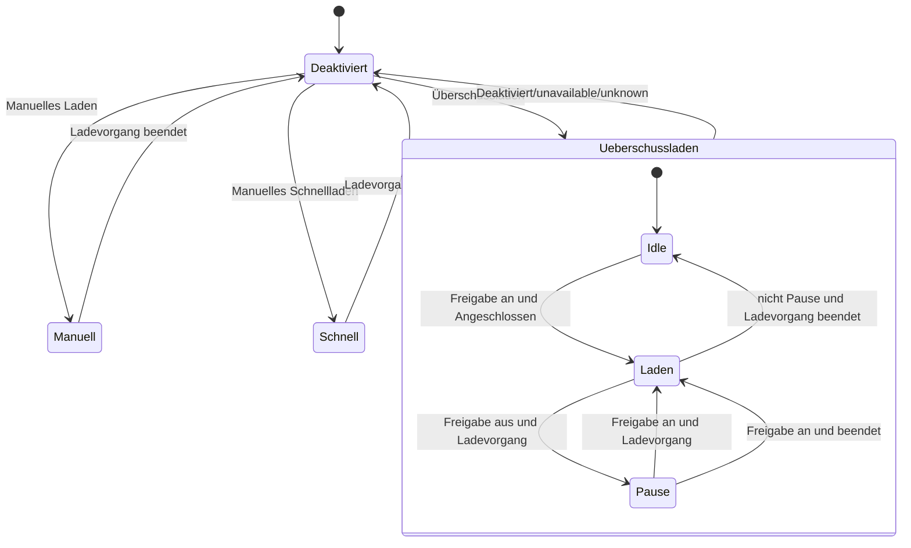
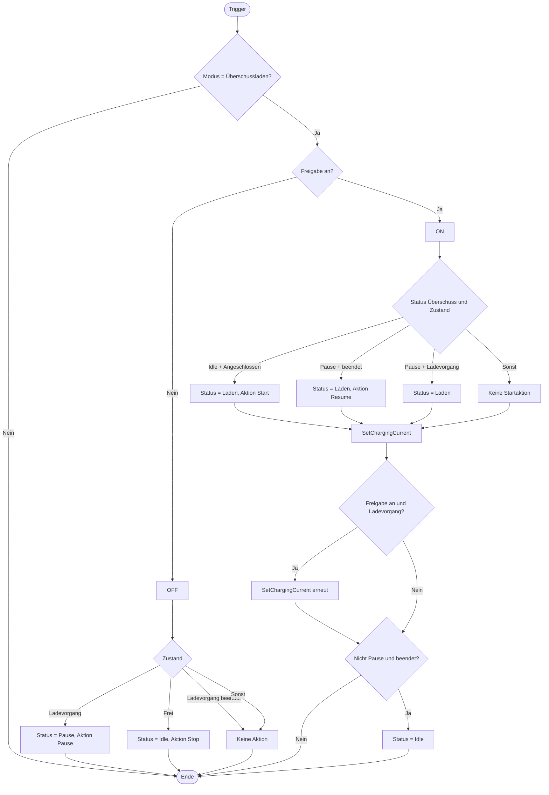

# Wallbox Lademodus State Machine (Home Assistant Blueprint)

Dieser Blueprint bildet eine vollständige Zustandsmaschine (State Machine) für eine Wallbox in Home Assistant ab.
Er unterstützt:

- **Lademodi (Hauptzustände)**
  - `Deaktiviert`
  - `Überschussladen`
  - `Manuelles Laden`
  - `Manuelles Schnellladen`

- **Interne Zustände im Überschussladen-Modus**
  - `Idle`
  - `Laden`
  - `Pause`

Der Blueprint sorgt automatisch dafür, dass Ladezustand, Ladestrom, Start/Pause/Resume/Stop und Überschusslogik vollständig automatisiert funktionieren.

---

## 📂 Dateien in diesem Paket

- `blueprint_wallbox_lademodus_statemachine.yaml`  
  → Blueprint für die komplette State Machine

- `wallbox_helpers_pv_and_script.yaml`  
  → Alle benötigten Helper (input_select, input_boolean), PV-Überschusssensoren und Beispielskript für die Wallbox

- `README.md`  
  → Dokumentation, Diagramme und Erläuterungen

---

## 📦 Benötigte Helfer (Helper Entities)

Alle Helper und das Script sind in `wallbox_helpers_pv_and_script.yaml` bereits enthalten.  
Zur Übersicht hier noch einmal die wichtigsten Bausteine.

### 1. Lademodus Wallbox (input_select)

```yaml
input_select:
  lademodus_wallbox1:
    name: Lademodus Wallbox 1
    options:
      - Deaktiviert
      - Überschussladen
      - Manuelles Laden
      - Manuelles Schnellladen
```

### 2. Zustand Wallbox (input_select)

```yaml
input_select:
  zustand_wallbox1:
    name: Zustand Wallbox 1
    options:
      - Frei
      - Angeschlossen
      - Ladevorgang
      - Ladevorgang beendet
```

### 3. Status Überschussladen (input_select)

```yaml
input_select:
  status_uberschussladen_wallbox1:
    name: Status Überschussladen Wallbox 1
    options:
      - Idle
      - Laden
      - Pause
```

### 4. Wallbox Freigabe (input_boolean)

```yaml
input_boolean:
  wallbox_freigabe:
    name: Wallbox Freigabe (PV-Modus)
    icon: mdi:solar-power
```

---

## 🔆 Automatische PV-Überschussberechnung

Die automatische PV-Überschussberechnung besteht aus **zwei Template-Sensoren**:

1. `sensor.pv_ueberschuss` – berechnet den PV-Überschuss in Watt  
2. `sensor.berechneter_moglicher_ladestrom` – berechnet daraus den möglichen Ladestrom in Ampere

Beides ist in `wallbox_helpers_pv_and_script.yaml` enthalten. Zur Veranschaulichung:

```yaml
template:
  - sensor:
      - name: "pv_ueberschuss"
        unique_id: pv_ueberschuss
        unit_of_measurement: "W"
        state: >
          
          
          {{ max(0, pv - haus) }}
        attributes:
          kommentar: "Bitte sensor.pv_gesamtleistung und sensor.hausverbrauch_gesamt an deine Installation anpassen."

      - name: "berechneter_moglicher_ladestrom"
        unique_id: berechneter_moglicher_ladestrom
        unit_of_measurement: "A"
        state: >
          
          
          
          
          {{ max(0, ampere) }}
        attributes:
          kommentar: "Wandelt PV-Überschuss in maximal möglichen Ladestrom (3-phasig, 230V) um."
```

> **Hinweis:**  
> Ersetze `sensor.pv_gesamtleistung` und `sensor.hausverbrauch_gesamt` durch deine realen Sensoren (z. B. aus Wechselrichter, Smart Meter oder Energiezähler).  
> Die Berechnung geht von **3-phasiger Ladung** bei **230 V** aus. Falls du anders lädst, passe `phasen` und `spannung` im Template an.

Den Sensor `sensor.berechneter_moglicher_ladestrom` verwendest du dann im Blueprint als **`charging_current_sensor`**.

---

## 🧬 Wallbox-Steuerscript

Beispiel: MQTT-basierte Steuerung. Dies ist in `wallbox_helpers_pv_and_script.yaml` enthalten.

```yaml
script:
  wallboxaction:
    alias: Wallbox Aktion
    mode: parallel
    fields:
      action:
        description: "Wallbox Aktion (Start, Stop, Pause, Resume, SetChargingCurrent)"
      chargingCurrent:
        description: "Ladestrom in Ampere (optional für SetChargingCurrent)"
    sequence:
      - choose:
          - conditions: "{{ action == 'Start' }}"
            sequence:
              - service: mqtt.publish
                data:
                  topic: wallbox/cmd
                  payload: '{"cmd":"start"}'

          - conditions: "{{ action == 'Stop' }}"
            sequence:
              - service: mqtt.publish
                data:
                  topic: wallbox/cmd
                  payload: '{"cmd":"stop"}'

          - conditions: "{{ action == 'Pause' }}"
            sequence:
              - service: mqtt.publish
                data:
                  topic: wallbox/cmd
                  payload: '{"cmd":"pause"}'

          - conditions: "{{ action == 'Resume' }}"
            sequence:
              - service: mqtt.publish
                data:
                  topic: wallbox/cmd
                  payload: '{"cmd":"resume"}'

          - conditions: "{{ action == 'SetChargingCurrent' }}"
            sequence:
              - service: mqtt.publish
                data:
                  topic: wallbox/cmd
                  payload: >
                    {"cmd":"setCurrent","amp":{{ chargingCurrent | int }}}
```

Du kannst diesen Block an deine Wallbox (REST, Modbus, MQTT, ...) anpassen.

---

## 🧠 Funktionsweise der State Machine

Die Logik besteht aus drei Teilen:

1. **Lademodus (`input_select.lademodus_wallbox1`)**  
   – bestimmt, welcher Hauptzweig aktiv ist

2. **Zustand der Wallbox (`input_select.zustand_wallbox1`)**  
   – beschreibt, was die Wallbox gerade macht

3. **Überschuss-Status (`input_select.status_uberschussladen_wallbox1`)**  
   – interne Sub-Statemachine für PV-Überschussladen

Der Blueprint wird ausgelöst:

- alle 5 Minuten (time_pattern)
- bei Änderung des Lademodus

---

## 🔄 State Machine – Mermaid (Hauptzustände)



---

## 🔁 Aktivitätsdiagramm – Überschussladen-Zweig



---

## 🚀 Installation

1. Kopiere
   - `blueprint_wallbox_lademodus_statemachine.yaml` nach  
     `config/blueprints/automation/<dein_ordner>/`
   - `wallbox_helpers_pv_and_script.yaml` in deine `configuration.yaml` oder lade sie per `!include` (z. B. `!include wallbox_helpers_pv_and_script.yaml`).

2. Home Assistant neu starten oder Konfiguration neu laden.

3. Unter **Einstellungen → Automationen & Szenen → Blueprints** den Blueprint auswählen.

4. Neue Automation auf Basis des Blueprints erstellen und zuordnen:
   - `Lademodus Wallbox 1`
   - `Zustand Wallbox 1`
   - `Status Überschussladen Wallbox 1`
   - `Wallbox Freigabe`
   - `berechneter_moglicher_ladestrom`
   - `script.wallboxaction`

5. Testen: Modus umschalten, Freigabe setzen, Wallbox-Zustand simulieren und MQTT (oder andere Schnittstelle) beobachten.

---

Viel Spaß beim smarten Überschussladen deiner Wallbox! ⚡️🔌
